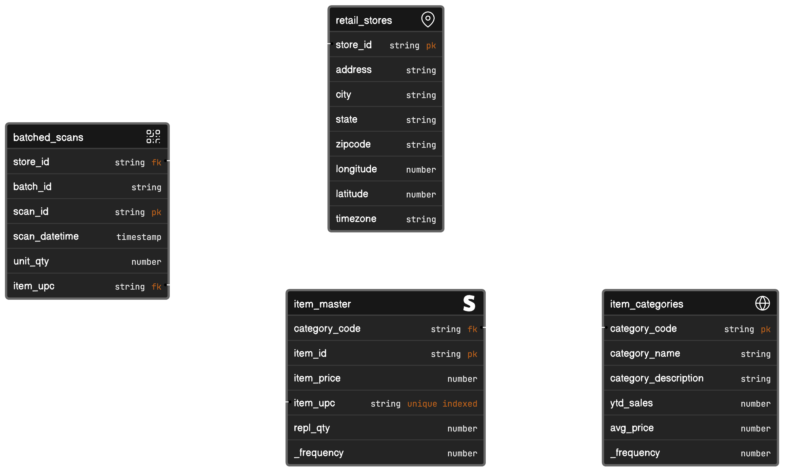

# acme demo
For various data management and analytics demonstrations, I've been building up this ACME company dataset and various data generators and utilities. I'm going to start cleaning it up and placing it here. 

Note that the `batched_scans` table is to be generated with a data generator.

### Notes

1. The item master is random and simple. I'd like to improve it. A much better item master is available, for a price, at: https://crawlfeeds.com/datasets/target-products-dataset
